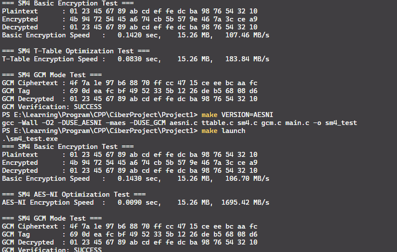

# 密码算法与优化说明文档

本项目实现了多种对称加密算法及优化方案，包括 SM4、AES-GCM，以及利用 AES-NI 指令集的加速实现。  

---

## 1. SM4 算法与 T-Table 优化

### 1.1 SM4 概述
SM4 是中国国家商用密码算法标准（GB/T 32907-2016）中的对称分组加密算法，块长 128 位，密钥长 128 位，轮数 32。广泛用于金融和无线通信数据加密。

### 1.2 基础算法
- **迭代轮函数**：32 轮
- **非线性变换**：S-box
- **线性变换**：L 变换
- **轮密钥扩展**：通过 FK 和 CK 常量生成 32 轮轮密钥

加密公式：
\[
X_{i+4} = X_i \oplus L(F(X_{i+1} \oplus X_{i+2} \oplus X_{i+3} \oplus RK_i))
\]

### 1.3 T-Table 优化
- 将 S-box + L 变换预计算成查找表
- 每轮仅通过 4 次表查找 + XOR 完成
- 显著提升加密速度，尤其是批量加密场景

### 1.4 实验效果

---

## 2. AES-GCM 算法

### 2.1 概述
AES-GCM（Galois/Counter Mode）是 AES 的一种认证加密模式（AEAD），同时提供 **加密** 与 **消息认证（MAC）**。  
- 块长度：128 位  
- 密钥长度：128/192/256 位  
- 模式：计数器模式（CTR） + GHASH 校验  

### 2.2 算法结构
1. **AES-CTR 加密**：明文按块加密，计数器每块递增  
2. **GHASH 认证**：生成消息认证码（MAC）  
3. 输出：密文 + TAG

公式：
\[
C_i = P_i \oplus AES_K(\text{CTR}_i)
\]  
\[
\text{TAG} = GHASH(H, A, C)
\]  
其中：
- \(H = AES_K(0^{128})\)
- \(A\) 为附加认证数据
- \(C\) 为密文

### 2.3 优化方法
- 利用 **表格加速 GHASH**  
- 批量计数器块并行化  
- 支持硬件加速（AES-NI）

---

## 3. AES-NI 硬件加速

### 3.1 概述
AES-NI 是 Intel CPU 提供的 AES 指令集，用于加速 AES 加密/解密：
- 包括 AESENC/AESDEC/AESENCLAST/AESDECLAST 指令
- 支持硬件实现 AES-ECB、AES-CBC、AES-CTR 等模式
- 与 GCM 模式结合可显著提高加密吞吐量

### 3.2 优势
- 避免大量轮函数计算
- 大幅降低 CPU 占用
- 支持并行流水线处理多块数据

---

## 4. 总结

| 算法 | 优化方法 | 特点 | 典型应用 |
|------|-----------|------|-----------|
| SM4 | T-Table | 软件加速、批量数据快速加密 | 金融、无线通信 |
| AES | GCM | 同时加密与认证 | TLS、VPN、云存储 |
| AES | AES-NI | 硬件加速，吞吐量高 | 高性能服务器、网络加密 |

运行效果

### 3.3 实验效果
本项目实现了基础算法、软件优化以及硬件加速方案，方便性能对比和安全验证。

可以看到 ANESNI 的加速效果非常大。

