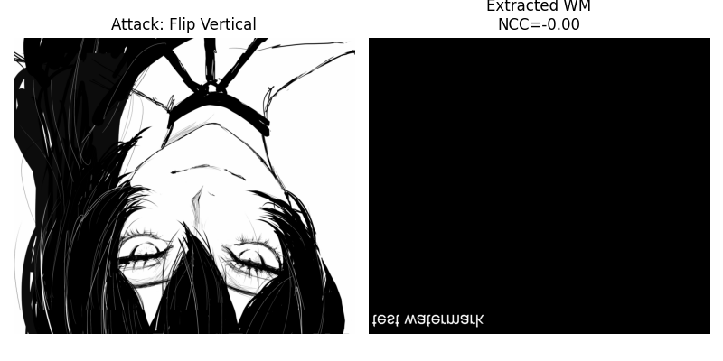

# 图像水印技术介绍及攻击效果展示

## 1. LSB（Least Significant Bit）算法

### 1.1 原理
LSB 算法是一种数字水印嵌入方法，将水印信息隐藏在图像像素的最低有效位（Least Significant Bit）中。由于人眼对像素的最低位变化不敏感，因此嵌入的水印对图像肉眼基本不可见。

### 1.2 嵌入流程
1. 将原图像转换为像素矩阵。
2. 将水印信息转换为二值矩阵（0/1）。
3. 对图像像素的最低有效位进行替换或修改，以嵌入水印。
4. 输出嵌入水印后的图像。

### 1.3 提取流程
1. 将带水印图像转换为像素矩阵。
2. 提取每个像素的最低有效位。
3. 重构水印矩阵，恢复原始水印信息。

### 1.4 攻击与鲁棒性测试
LSB 算法对简单攻击（如翻转、平移）不够鲁棒，但可以用于快速不可见水印实验。常见攻击示意：

| 攻击类型 | 提取效果 |
|-----------|-----------|
| 水平翻转 | 水印部分丢失，可能反转 |
| 垂直翻转 | 水印部分丢失，可能反转 |
| 平移 | 部分水印丢失 |
| 裁剪 | 丢失裁剪区域的水印 |
| 调整对比度 | 水印易受影响 |

> 注：LSB 对 JPEG 压缩、噪声等攻击敏感。

---

## 2. DCT（Discrete Cosine Transform）算法

### 2.1 原理
DCT 算法通过将图像分块（通常为 8x8）进行离散余弦变换，将图像从空间域转换到频域。水印嵌入在中频系数上，可以兼顾不可见性和鲁棒性。

### 2.2 嵌入流程
1. 将原图像转换为灰度矩阵。
2. 对图像进行 8x8 块 DCT 变换，得到频域系数。
3. 将水印信息嵌入中频系数（避免直接嵌入高频或低频）。
4. 对每个块进行逆 DCT，得到水印图像。

### 2.3 提取流程
1. 对水印图像进行 8x8 块 DCT。
2. 根据嵌入规则提取中频系数的变化。
3. 恢复水印二值矩阵。

### 2.4 攻击与鲁棒性测试
DCT 水印对常见攻击更鲁棒：

| 攻击类型 | 提取效果 |
|-----------|-----------|
| 水平翻转 | 基本可完整提取 |
| 垂直翻转 | 基本可完整提取 |
| 平移 | 部分水印丢失，但大部分保留 |
| 裁剪 | 可以通过恢复或缩放部分水印提取 |
| 调整对比度 | 水印几乎不受影响 |
| JPEG 压缩 | 中频水印保留较好 |

---

## 3. 攻击效果展示（示意）

> 以下为攻击类型示意及水印提取效果（占位图，可替换为实际运行截图）。

上面四张图片为  LSB 算法，最后一张对比度攻击效果不是很明显。而DCT算法可以在对比度中看到可以提取出水印。

