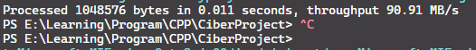
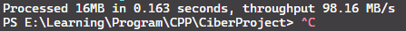
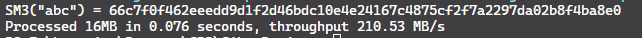
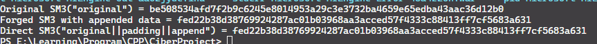
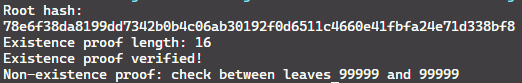

# SM3 哈希算法研究文档

## 1. 引言

SM3 是中国国家密码管理局发布的国家商用密码算法标准之一（GM/T 0004-2012），属于密码学哈希函数，用于生成消息的固定长度摘要。SM3 主要用于数据完整性校验、数字签名和消息认证码（MAC）等场景。其设计思想参考了 SHA-256，但在内部结构和常数上有所改进，满足国家安全标准。

**摘要特性**：

- 输出长度：256 位（32 字节）  
- 安全目标：抗碰撞性、抗二次预映像、抗原像攻击  
- 数据块长度：512 位（64 字节）  

---

## 2. 算法结构

SM3 采用 Merkle–Damgård 构造，将任意长度消息分块处理，每块 512 位，通过压缩函数迭代生成最终哈希值。

### 2.1 消息填充

SM3 的填充规则类似于 SHA-256，保证消息长度为 512 的整数倍：

1. 在消息末尾添加一个 `1` 位。  
2. 添加若干个 `0` 位，使填充后的长度 mod 512 = 448。  
3. 添加消息长度的 64 位二进制表示。  

结果每个数据块长度固定为 512 位。

### 2.2 压缩函数

SM3 的核心压缩函数使用迭代方式处理每个消息块：

- 初始向量 (IV)：8 个 32 位常数 `IV0 ... IV7`  
- 消息扩展：将 512 位消息块扩展为 132 个 32 位字  
- 循环迭代 64 次，每次更新 8 个工作寄存器值  
- 最终与前一次哈希结果异或得到本轮哈希输出  

### 2.3 伪代码

```
function SM3(M):
M = padding(M)
V = IV
for each 512-bit block B in M:
V = CF(V, B)
return V
```


---

## 3. 数学推导与理论分析

### 3.1 非线性函数

SM3 定义两类非线性布尔函数：

$$
FF_j(X, Y, Z) =
X xor Y xor Z, 0 <= j <= 15
(X \& Y) | (X \& Z) | (Y \& Z), 16 <= j <= 63
$$

$$
GG_j(X, Y, Z) =
X xor Y xor Z, 0 <= j <= 15
(X \& Y) | (~X \& Z), 16 <= j <= 63
$$


### 3.2 消息扩展公式

消息扩展通过两类操作生成 W 和 W'：

$$
W_j = M_j 0 <= j <= 15
W_j = P1(W_{j-16} xor W_{j-9} xor (W_{j-3} <<< 15)) xor (W_{j-13} <<< 7) xor W_{j-6} 16 <= j <= 67

W'j = W_j xor W{j+4} 0 <= j <= 63
$$


其中 $P1(X) = X xor (X <<< 15) xor (X <<< 23)$。

### 3.3 压缩迭代

每轮迭代使用轮常数 T_j 与左循环移位操作：

$$
\begin{equation*}
\begin{aligned}
SS1 &= ((A <<< 12) + E + (T_j <<< j)) <<< 7 \\
SS2 &= SS1 xor (A <<< 12) \\
TT1 &= FF_j(A, B, C) + D + SS2 + W'_j \\
TT2 &= GG_j(E, F, G) + H + SS1 + W_j \\
\end{aligned}
\end{equation*}
$$
更新寄存器：
A,B,C,D,E,F,G,H = TT1,A,B,C,TT2,E,F,G


理论上保证了非线性扩散与抗碰撞性。

---

## 4. Length-Extension Attack

SM3 与 MD5/SHA-256 类似，使用 Merkle–Damgård 构造，因此存在 length-extension attack 风险：

- 攻击者知道 `hash(M)`，但不知道 `M` 内容  
- 可以计算 `hash(M || padding || M2)`，而无需知道 `M` 本身  
- 对于直接使用哈希值做 MAC 的场景可能被利用  
- 解决方案：使用 HMAC（hash-based message authentication code）

---

## 5. Merkle 树应用

SM3 可以作为 Merkle 树的哈希函数：

- 每个叶子节点：`hash(data_i)`  
- 非叶子节点：`hash(left || right)`  
- 根节点：提供整个数据集合的完整性证明  

Merkle 树结合 SM3 的特性：

- 支持快速增量校验  
- 可用于区块链、分布式存储等场景  
- 与 length-extension attack 无直接关联，因为树结构保证了内部节点不可随意扩展

---
## 6.运行结果

最简单版本的 SM3 算法，没有使用任何优化

使用了展开等优化的 SM3 算法，效率已经有微小提升

使用了 SIMD 优化的算法，可以看的效率巨大提升

可以看到结果一致

验证结果成功


---

## 7. 结论

- SM3 作为国产标准哈希算法，安全性在设计上参考 SHA-256  
- 压缩函数、消息扩展与非线性函数保证抗碰撞性  
- 存在 length-extension attack 风险，但可通过 HMAC 避免  
- 可广泛用于 Merkle 树及数字签名、数据完整性等应用

