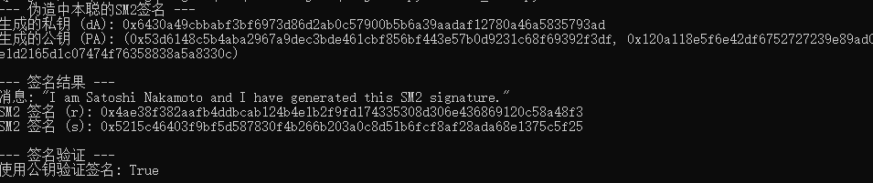

# SM2 研究文档

## 1. 算法概述

SM2 是中国国家密码管理局（GM/T 0003-2012）发布的公钥密码算法标准，属于 **椭圆曲线公钥密码算法（ECC）** 系列，主要用于：

- 数字签名  
- 公钥加密  
- 密钥交换  

SM2 的核心特点：

- 基于椭圆曲线离散对数问题（ECDLP），安全性依赖于该问题的难解性  
- 提供比 RSA 更高的安全性和更小的密钥长度（256 位椭圆曲线等效于 3072 位 RSA）  
- 支持数字签名生成和验证，符合国密标准  

---

## 2. 数学基础

### 2.1 椭圆曲线定义

SM2 采用 Weierstrass 型椭圆曲线：

\[
E: y^2 = x^3 + ax + b \mod p
\]

参数如下：

- \(p\) ：大素数（椭圆曲线的模数）  
- \(a, b\) ：曲线参数  
- \(G = (x_G, y_G)\) ：基点（生成点）  
- \(n\) ：基点阶  
- \(h\) ：曲线余因子（通常为 1）  

### 2.2 椭圆曲线运算

SM2 的核心运算包括：

1. **点加法** \(P + Q\)  
2. **标量乘法** \(kP = P + P + \dots + P\) （重复 k 次）  

这些运算保证了离散对数问题的难解性：

\[
\text{已知 } P \text{ 与 } Q=kP，\text{ 求 } k \text{ 非常困难。}
\]

---

## 3. SM2 数字签名算法

### 3.1 签名生成

假设用户私钥为 \(d_A \in [1, n-1]\)，公钥为 \(P_A = d_A G\)。签名流程：

1. 消息哈希：计算 \(\text{e} = H(M)\)，其中 H 为 SM3 哈希函数  
2. 随机数选择：选择 \(k \in [1, n-1]\)  
3. 计算椭圆曲线点 \(kG = (x_1, y_1)\)  
4. 计算签名值：
   \[
   r = (e + x_1) \mod n
   \]
   \[
   s = ((1 + d_A)^{-1} (k - r d_A)) \mod n
   \]
5. 输出签名 \((r, s)\)  

### 3.2 签名验证

验证者获取消息 \(M\) 和签名 \((r, s)\)：

1. 计算 \(\text{e} = H(M)\)  
2. 计算：
   \[
   t = (r + s) \mod n
   \]  
   \[
   (x_1', y_1') = sG + tP_A
   \]  
3. 验证：
   \[
   r \stackrel{?}{=} (e + x_1') \mod n
   \]

---

## 4. 理论分析

- **安全性依赖**：ECDLP 难题、哈希函数安全性  
- **防伪造能力**：若随机数 \(k\) 泄露，攻击者可计算私钥  
- **随机数生成要求**：必须每次签名不同，否则存在重放攻击风险  

---

## 5. PoC 验证场景

为了验证 SM2 签名算法，可设计如下场景：

1. **合法签名验证**  
   - 生成密钥对 \((d_A, P_A)\)  
   - 对消息 \(M\) 生成签名 \((r, s)\)  
   - 验证签名正确性  

2. **重复使用随机数攻击**  
   - 使用同一个随机数 \(k\) 生成两条不同消息签名  
   - 计算私钥公式：
     \[
     d_A = ((s_1 - s_2)^{-1} (k - r_1 + r_2)) \mod n
     \]  
   - 验证可恢复私钥  

3. **伪造签名尝试**  
   - 构造 \(r\) 和 \(s\) 满足验证方公式  
   - 理论上，如果不知私钥和随机数，伪造签名概率极低  

---

## 6. 伪造签名的数学原理

SM2 签名验证公式：

\[
r = (e + x_1') \mod n, \quad (x_1', y_1') = sG + (r+s)P_A
\]

伪造签名的核心数学原理：

1. **已知公钥 \(P_A\) 和消息哈希 e**  
2. 构造 \(r', s'\) 满足：
   \[
   x_1' = r' - e \mod n
   \]  
   \[
   s'G + (r'+s')P_A = (x_1', y_1')
   \]  
3. 直接求解 \(s'\) 很困难，因为这是椭圆曲线离散对数问题  
4. 若攻击者能控制随机数 \(k\)，则可伪造签名  

---

## 7. 运行结果

检验 SM2 算法正确性

SM2 算法的泄漏场景

伪造密钥成功

---

## 8. 总结

- SM2 是安全性较高的椭圆曲线签名算法  
- 安全性依赖随机数不可预测性与 ECDLP 难题  
- PoC 场景可用于验证算法实现和研究潜在攻击方式  
- 伪造签名主要依赖随机数泄露或数学弱点  
