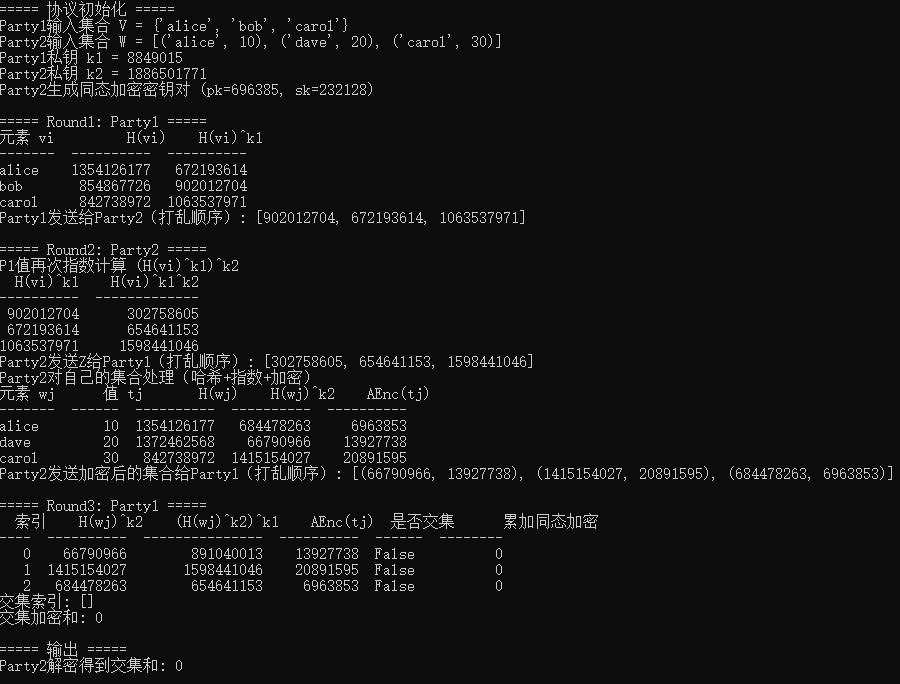

# DDH-Based Private Intersection-Sum Protocol 研究文档

## 1. 算法概述

该协议旨在解决 **Private Intersection-Sum (PIS)** 问题，即两个参与方分别持有一组元素及其对应的数值，目标是：

- 计算集合交集的元素总数（cardinality）  
- 计算交集元素对应数值的和（intersection-sum）  

同时保证：

- **隐私保护**：参与方只能学习交集信息，不泄露其他集合元素  
- **半诚实安全（honest-but-curious, HBC）**：协议在参与方按规范执行但试图窃取信息的情况下仍安全  

核心思想：

- 基于 **离散对数难题（DDH 假设）**  
- 使用 **加法同态加密** (Additively Homomorphic Encryption)  
- 使用 **随机置换与哈希函数** 对输入进行混淆  

协议可视为：

- 对消息进行哈希和指数运算的 **随机函数（ROM PRF）评估**  
- 或 **Pohlig-Hellman 加密** 的共享密钥版本  

---

## 2. 数学基础

### 2.1 离散对数与 DDH 假设

- 设 \(G\) 为素数阶 \(p\) 的循环群，生成元 \(g \in G\)  
- DDH (Decisional Diffie-Hellman) 假设：给定 \((g, g^a, g^b, g^c)\)，无法判定 \(c = ab \mod p\)  

### 2.2 加法同态加密

- 加密函数 \(AEnc_{pk}(m)\) 满足：
\[
AEnc_{pk}(m_1) \oplus AEnc_{pk}(m_2) = AEnc_{pk}(m_1 + m_2)
\]  
- 用于计算集合交集对应数值的和，而无需解密单个元素  

### 2.3 哈希函数

- 哈希函数 \(H: U \rightarrow G\)  
- 模型为 **随机预言机 (Random Oracle)**  
- 作用：将任意元素映射到群 \(G\) 的随机元素，用于隐藏元素本身  

---

## 3. 协议参与方与输入

- **P1**：持有集合 \(V = \{v_1, \dots, v_{m_1}\}\)  
- **P2**：持有集合 \(W = \{(w_1, t_1), \dots, (w_{m_2}, t_{m_2})\}\)，其中 \(t_j \in \mathbb{Z}^+\)  

公共参数：

- 群 \(G\)（素数阶）  
- 哈希函数 \(H\)  
- 加法同态加密方案 \(AEnc, ADec\)  

私钥：

- \(k_1 \in \mathbb{Z}_p\)：P1 的随机指数  
- \(k_2 \in \mathbb{Z}_p\)：P2 的随机指数  
- \(sk, pk\)：P2 的同态加密密钥对  

---

## 4. 协议步骤

### 4.1 Setup

1. P1, P2 各选择随机指数 \(k_1, k_2\)  
2. P2 生成同态加密密钥对 \((pk, sk)\)，发送 \(pk\) 给 P1  

### 4.2 Round 1 (P1)

1. 对每个 \(v_i \in V\)，计算：
\[
h_i = H(v_i)^{k_1} \in G
\]  
2. 将所有 \(h_i\) 打乱顺序发送给 P2  

### 4.3 Round 2 (P2)

1. 对每个接收到的 \(h_i\)，计算：
\[
h_i' = h_i^{k_2} = H(v_i)^{k_1 k_2} 
\]  
2. 将 \(h_i'\) 打乱顺序发送回 P1  
3. 对自身集合 \(W\) 中的每个元素 \((w_j, t_j)\)，计算：
\[
H(w_j)^{k_2}, \quad AEnc_{pk}(t_j)
\]  
4. 将 \((H(w_j)^{k_2}, AEnc(t_j))\) 打乱顺序发送给 P1  

### 4.4 Round 3 (P1)

1. 对接收到的 \((H(w_j)^{k_2}, AEnc(t_j))\) 进行指数运算：
\[
(H(w_j)^{k_2})^{k_1} = H(w_j)^{k_1 k_2} 
\]  
2. 计算交集：
\[
J = \{ j : H(w_j)^{k_1 k_2} \in \{H(v_i)^{k_1 k_2}\} \}
\]  
3. 对交集对应的同态加密值求和：
\[
AEnc_{pk}(S_J) = \bigoplus_{j \in J} AEnc(t_j)
\]  
4. 随机化密文并发送给 P2  

### 4.5 Output (P2)

- 使用私钥 \(sk\) 解密：
\[
S_J = ADec_{sk}(AEnc(S_J))
\]  
- 得到交集元素总和  

---

## 5. 正确性证明

1. 哈希与指数运算保持唯一映射性（DDH 假设下难以逆向）  
2. 交集计算：
\[
H(w_j)^{k_1 k_2} \in \{H(v_i)^{k_1 k_2}\} \iff w_j \in V
\]  
3. 同态加密求和正确：
\[
AEnc(t_1) \oplus AEnc(t_2) \oplus \dots = AEnc(t_1 + t_2 + \dots)
\]  

因此 P2 可正确得到交集总和 \(S_J\)  

---

## 6. 安全分析（HBC 模型）

### 6.1 对 P1

- P1 只能看到 P2 发送的加密值和指数结果  
- 基于 **DDH 假设**，指数运算后的值对 P1 来说是伪随机  
- P1 无法恢复 P2 的原始集合元素  

### 6.2 对 P2

- P2 只能看到 P1 的指数化哈希值  
- 不能得知 P1 集合中未交集元素  
- 同态加密保证 P2 只能解密交集和，不泄露单个元素值  

### 6.3 模拟器证明（理论）

- 存在 PPT 模拟器 SIM1, SIM2，使真实协议视图可用模拟值替代  
- 安全性通过 **混合实验（hybrid argument）** 与 **DDH 假设**、同态加密安全性保证  

---

## 7. 数学推导示例

1. 交集验证：
\[
w_j \in V \iff H(w_j)^{k_1 k_2} = H(v_i)^{k_1 k_2}
\]  

2. 同态加密求和：
\[
AEnc(t_1) \oplus \dots \oplus AEnc(t_m) = AEnc\left(\sum_{j=1}^{m} t_j\right)
\]  

3. 交集总和解密：
\[
S_J = ADec_{sk}(AEnc(S_J)) = \sum_{j \in J} t_j
\]  

---
## 8. 运行结果

---

## 9. 总结

- 本协议实现了 **半诚实安全的交集求和**  
- 使用 **DDH 假设** 和 **加法同态加密** 保证隐私  
- 核心步骤：哈希 → 指数 → 打乱 → 交集匹配 → 同态求和  
- 可扩展：支持不同同态加密方案、批量处理、随机化增强安全性  

